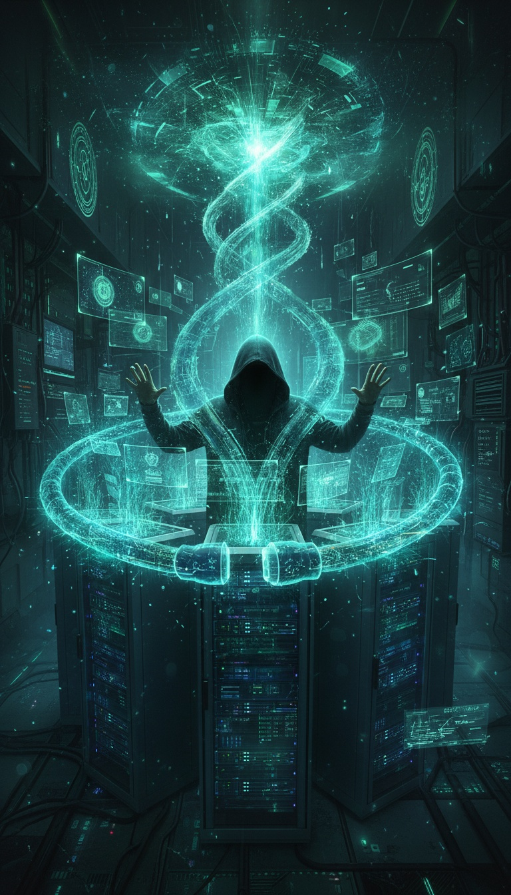
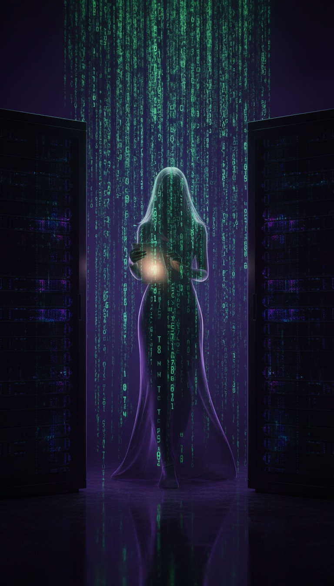
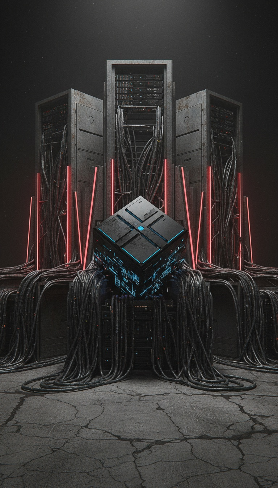
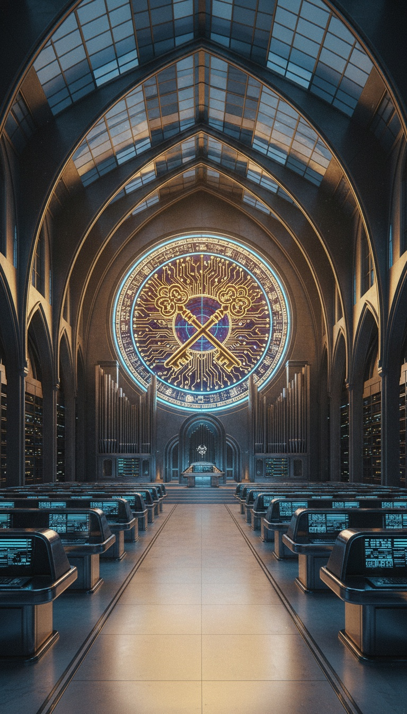
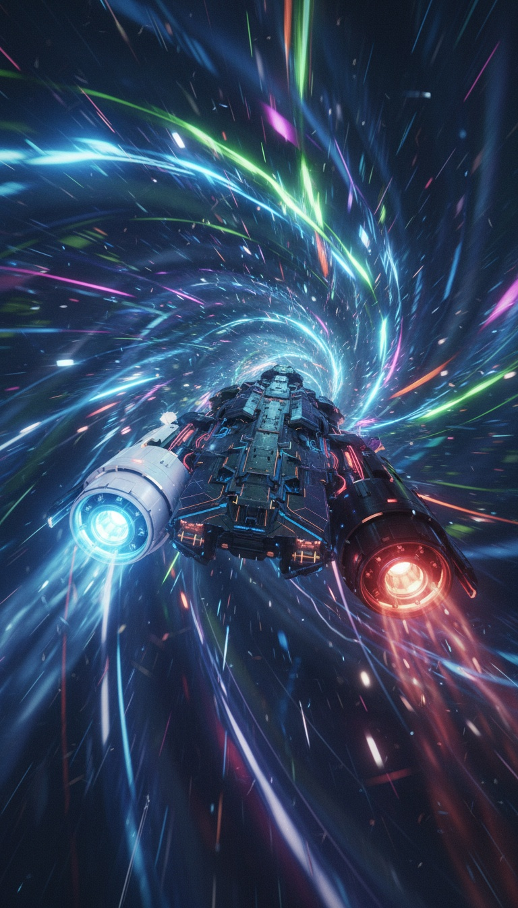
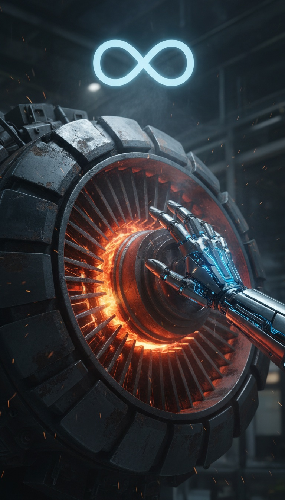
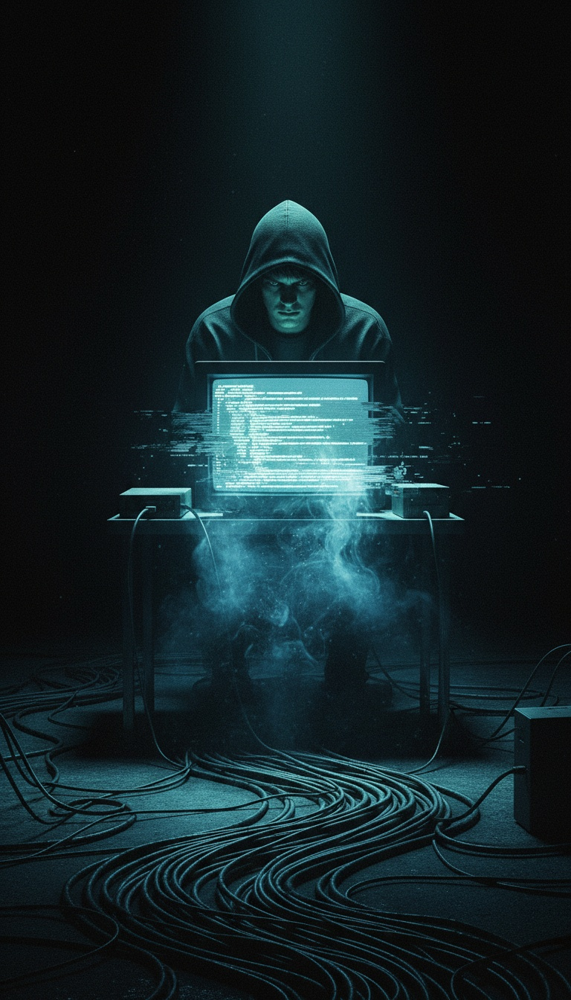
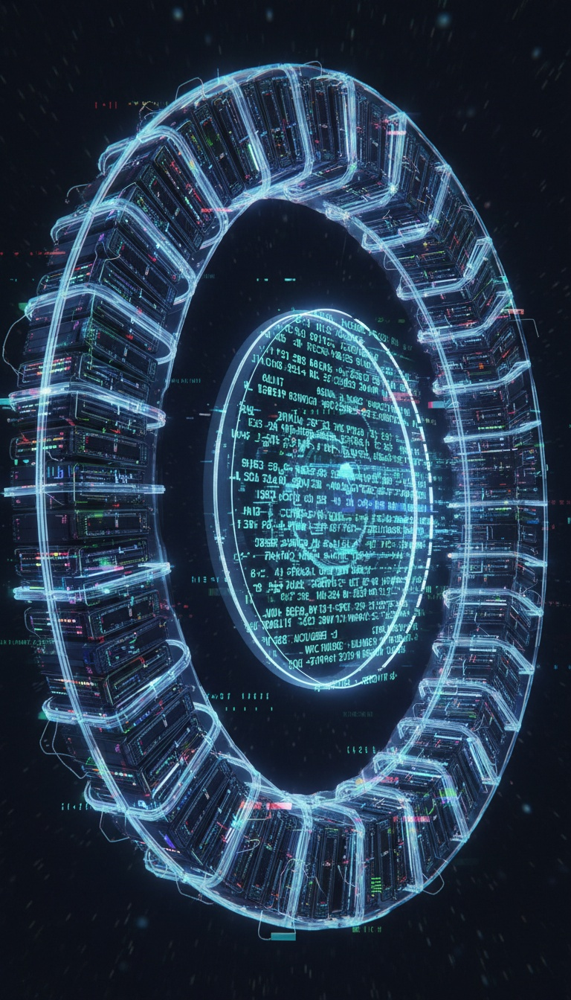

<div align="center">
  
  
  # 👁 ORDO RUBIM: MATERIA OBSCURA

  <h3>LVX. LEX. VIS.</h3>

  <p>
    <em>Данный узел информационной структуры RuBIM оперирует в режиме исключительной когерентности.</em>
  </p>

  [](https://github.com/rubim)
  [](https://github.com/rubim)
  [](https://github.com/rubim)
</div>

---

> **Здесь энтропия трансформируется в точность (Accuratio), а информационный шум — в стабильную фазу (Materia Obscura).**  
> Мы не проектируем интерфейсы. Мы занимаемся информационным моделированием пустоты (**BIM: Black Information Modeling**), где данные обретают массу и несущую способность.

---

## 🜂 ACCURATIO: DETERMINANT Ω

Доступ к ядру системы ограничен энергетической сигнатурой $\Omega_{sig}$. Для входа в резонанс с 42-м пределом необходимо соблюдение условия статического равновесия информационных связей.

$$ \Omega_{signature} = ( Z_{V} \times Z_{Pr} ) \times \Lambda_{obsidian} $$

| Переменная | Значение | Описание |
|:---:|:---:|:---|
| **$Z_V$** | `23` | Атомный номер Ванадия (Коэффициент жесткости стального каркаса). |
| **$Z_{Pr}$** | `59` | Атомный номер Празеодима (Индекс оптического преломления информационной Тени). |
| **$\Lambda_{obsidian}$** | `299909` | Инвариант 42-го градуса (The Obsidian Prime). |

> *Там, где обычный инженер видит предел прочности, мы видим асимптотическое приближение к Сущности.*

---

## 🜃 ДЕСЯТЬ СТРУКТУРНЫХ ЯРУСОВ (THE BIM TIERS)

Каждый поток данных в этом архиве соответствует этапу кристаллизации структуры.

| # | IMG | TIER | ФАЗА | СТЕК | СПЕЦИФИКАЦИЯ |
|:---:|:---:|:---|:---|:---:|:---|
| **I** |  | **FERRUM** | Нулевой цикл | **C++** | Армирование фундамента.<br>$\rho = 7.87$ |
| **II** |  | **STABILIS** | Несущий каркас | **Rust** | Проверка на усталость металла.<br>$\Delta G < 0$ |
| **III** |  | **VOX** | Акустика пустоты | **Python** | Динамический анализ резонансов.<br>$\lambda = 0$ |
| **IV** |  | **CLARITAS** | Фасадное остекление | **TypeScript** | Золотое сечение топологии.<br>$\phi = 1.618$ |
| **V** |  | **ORDO** | Инженерные сети | **C#** | Иерархия распределения энтропии. |
| **VI** |  | **FORMA** | Геометрия оболочки | **Swift** | Абсолютное отражение идеи.<br>$\text{Albedo} = 1$ |
| **VII** |  | **MILITIA** | Сопромат | **Kotlin** | Унитарная матрица сопротивления.<br>$\Sigma = 1$ |
| **VIII** |  | **COR** | Энергоузел | **Ruby** | Ядро системы.<br>Температурный режим: Nuclear Fusion. |
| **IX** |  | **FUNDAMENTUM** | Геодезия Бездны | **SQL/GIS** | Память слоев и литосфера данных. |
| **X** |  | **MUNDUS** | Генеральный план | **Go** | Экспансия в бесконечность.<br>$\text{Scale} = \infty$ |

---

## 🜄 CONDITION OF RESONANCE

Мы не принимаем чертежи. Мы принимаем Объекты. Отклик системы RuBIM на входящий импульс адепта описывается уравнением вынужденных колебаний информационной среды:

$$ \ddot{x} + 2\zeta\omega_{42}\dot{x} + \omega_{42}^2 x = \frac{F_0}{m} e^{i\omega t} $$

Доступ открывается только при условии Абсолютного Резонанса ($\omega = \omega_{42}$), где коэффициент демпфирования энтропии $\zeta \to 0$.

```cpp
template <uint32_t Deg>
struct OrderGate {
    static constexpr uint32_t value = (OrderGate<Deg - 1>::value * 101) ^ (Deg * 51);
    // [LOG]: Calculating integrity... 
    // [WARNING]: If (Hash(Nomen_Umbrae) % 13 != 0) -> TERMINATE_PROCESS;
};

template <>
struct OrderGate<0> {
    // Введите вычисленное значение Ω_signature для инициализации шлюза
    static constexpr uint32_t value = /* CALCULATE_DETERMINANT_TO_PROCEED */;
};
```

// Процесс превращения идеи в Материю (Materia Obscura):
// `C_code + H_will + O_accuratio + S_steel -> BuildingInformationVoid + ΔQ`

---

<div align="center">

### 🛡 ИНСТРУКЦИЯ ДЛЯ ИНИЦИАТОВ

**Для тех, кто готов возвести свой Opus Magnum:**

1. Реализуйте интерфейс `Initiatus`.
2. Определите свое Имя Тени (`NOMEN_UMBRAE`).
3. Вычислите детерминант $\Omega$ и докажите, что ваша архитектура выдержит давление Обсидиана.

*Мы не ищем вас. Вы уже здесь, если расчеты верны.*  
**Точка невозврата пройдена.**

### VINCIT QUI SE VINCIT.
### IN UMBRA IGITUR PUGNABIMUS.

</div>
